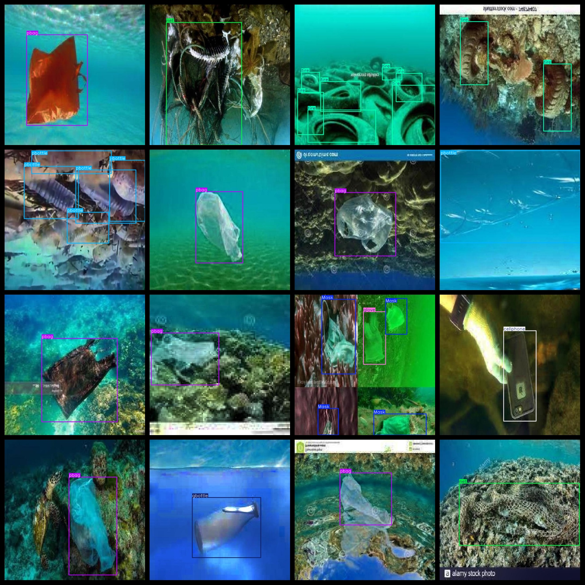
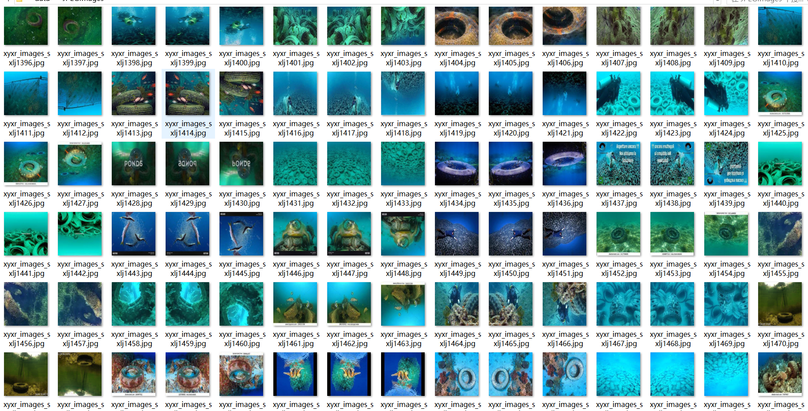

# [Object Detection] Underwater Garbage Dataset 5127 images YOLO+VOC format

[Object Detection] Underwater Garbage Dataset: 5127 images in YOLO+VOC format

Dataset format: VOC format + YOLO format

Compressed package includes: 3 folders, each storing images, xml, and txt files

JPEGImages folder contains a total of 5127 JPG images

Annotations folder contains a total of 5127 xml files

labels folder contains a total of 5127 txt files

Number of label types: 15

Label names: ["Mask", "can", "cellphone", "electronics", "gbottle", "glove", "metal", "misc", "net", "pbag", "pbottle", "plastic", "rod", "sunglasses", "tire"]

Labels: [ "Mask", "Canned Food", "Mobile Phone", "Electronic Product", "Glass Bottle", "Gloves", "Metal", "Miscellaneous", "Net", "Plastic", "Straw", "Sunglasses", "Tire" ]

Each label's number of bounding boxes (note that the order of categories in the YOLO format does not correspond to this, but is based on the classes.txt in the labels folder):

Mask bounding box count = 1572

can bounding box count = 163

cellphone bounding box count = 385

electronics bounding box count = 196

gbottle bounding box count = 484

glove bounding box count = 1261

metal bounding box count = 83

misc bounding box count = 257

net bounding box count = 744

pbag bounding box count = 1631

pbottle bounding box count = 1342

plastic bounding box count = 275

rod bounding box count = 37

sunglasses bounding box count = 18

tire bounding box count = 3211

Total bounding box count: 11659

Image resolution (pixels): Clear

Images are enhanced: Yes

Shape of labels: Rectangular bounding boxes for target detection recognition

Important note: No guarantees are made regarding the accuracy or weights of the trained models, the dataset only provides accurate and reasonable annotations.
## Images

---

Here is a pay link on Stripe (https://buy.stripe.com/3cs8yP7sY87d0vu9AB). Please contact me lonlonago@foxmail.com after funding $89, and I will send you a complete data files, thank you!

